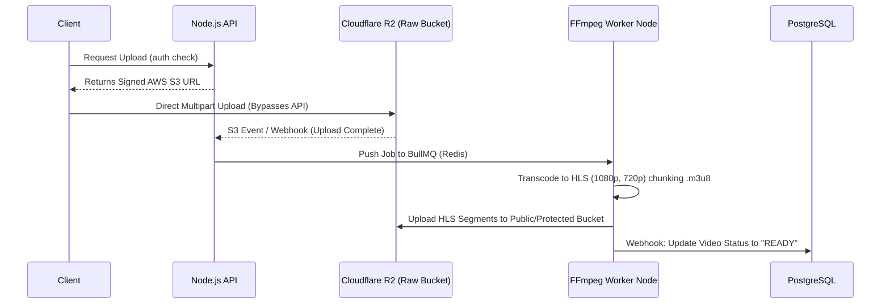
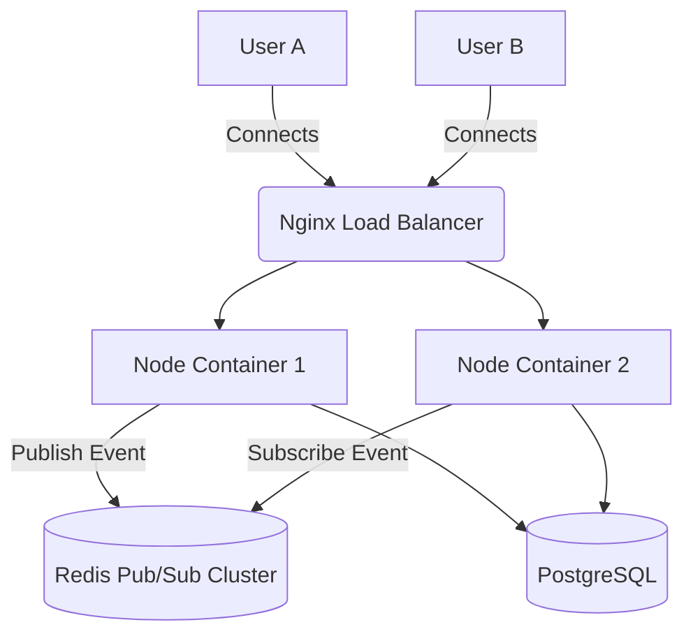
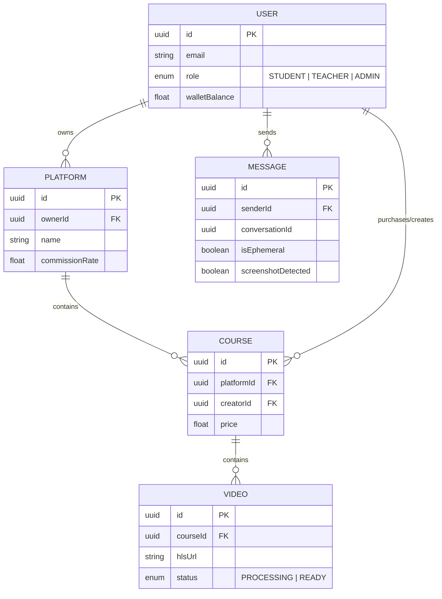

# Shazly Community for Students (SCS) — Enterprise Architecture & Operations Handbook

Welcome to the definitive engineering documentation for the **SCS Platform**. This document is designed for the CTO, Lead Architects, and Senior DevOps Engineers responsible for scaling this ecosystem to **1,000,000+ concurrent active users**.

SCS merges advanced video delivery (YouTube-like), nested multi-tenant learning management (Udemy-like), secure and ephemeral real-time chat (Telegram-like), and offline-first productivity (Notion-like) into a singular, highly resilient Event-Driven Monolith.

---

## 🏗️ 1. Core Construction Methodology

SCS is built on the **Modular, Event-Driven, Distributed Monolith** pattern.
Unlike traditional microservices which introduce extreme network latency and complex orchestration overhead, SCS retains a unified codebase while enforcing strict boundary contexts.

- **Statelessness:** The Node.js application layer holds exactly zero state. All session, socket presence, and rate-limiting data is instantly offloaded to Redis.
- **Event-Driven IO:** Heavy tasks (Video Encoding, Massive DB aggregations, Email routing) are strictly pushed to BullMQ/RabbitMQ to prevent main-thread event-loop blocking.
- **Data Locality:** High-frequency relational data lives in PostgreSQL, structured via Prisma. Unstructured binary blobs (Videos, Resumes) live in Cloudflare R2 Edge networks.
- **Client Resilience:** The Next.js frontend employs extensive Service Workers (`sw.js`) utilizing `Stale-While-Revalidate` caching algorithms, allowing the application to function seamlessly during internet outages.

---

## 🗺️ 2. Operating & Work Maps

### 2.1 The Video Delivery Pipeline (Zero-Bottleneck Architecture)
To ensure the backend does not crash when 50,000 instructors upload videos simultaneously, we bypass the Node.js server for data transfer entirely.



### 2.2 The Distributed WebSocket Chat Engine
A standard Node.js Socket.io server caps at roughly 65,000 connections due to OS Port exhaustion. SCS utilizes the Redis Adapter pattern to infinitely scale horizontally.



---

## 🗄️ 3. Database Entity-Relationship (ER) Map

The database architecture is designed to handle **Nested Multi-Tenancy**. A "Platform" belongs to an ecosystem, and "Courses" belong to that specific nested Platform.



---

## 🛡️ 4. Future Vulnerabilities & Solutions

As the platform scales to its full potential, standard web architectures will break. Here is the threat and failure intelligence matrix, and how SCS is architected to survive them.

### 🔴 1. The PostgreSQL "Connection Exhaustion" (Too many clients)
**The Threat:** Every new Node.js server instance or serverless function opens a pool of connections to Postgres. At scale (e.g., 500 API instances), PostgreSQL will crash instantly with `FATAL: sorry, too many clients already`.
**The Solution:** 
We must route **all** traffic through `PgBouncer` running in `Transaction Pooling Mode`. PgBouncer holds a persistent pool to PostgreSQL and multiplexes thousands of incoming lightweight client connections onto a small number of physical DB connections.

### 🔴 2. The Cache Stampede (Thundering Herd Problem)
**The Threat:** If a highly popular course page completes its Redis TTL and expires, 10,000 concurrent users will immediately hit the database to re-fetch the course data simultaneously, causing a CPU spike and DB crash.
**The Solution:** 
Implement "Promise Debouncing" and "Stale-While-Revalidate" at the cache layer. If 10,000 users request a missing cache key, the Node server groups the requests, sends exactly ONE query to PostgreSQL, and returns the result to all 10,000 awaiting promises.

### 🔴 3. WebSocket "Split-Brain" Memory Leaks
**The Threat:** If a Socket.io container crashes, clients immediately reconnect to a new container. If the old container didn't cleanly sweep its presence data from Redis, ghost users will appear online forever.
**The Solution:**
Redis Keys tracking user presence MUST utilize strict TTLs (Time-To-Live), utilizing a heartbeat ping from the client every 30 seconds. If a container dies, the Redis TTL naturally evicts the ghost user after 45 seconds without requiring cleanup code.

### 🔴 4. Financial Asynchrony (Stripe Webhook Misfires)
**The Threat:** If a user purchases a course, but the database crashes *right before* we add the course to their account, the user is charged but receives nothing.
**The Solution:**
Strict ACID `prisma.$transaction`. Within the Stripe Webhook handler, the debit operation, the Creator Revenue Split percentage distribution, and the Course Ownership assignment are bundled in a single block. If *any* step fails, the entire transaction rolls back cleanly.

### 🔴 5. Malicious Video Piracy (Downloading HLS Streams)
**The Threat:** Users extracting the physical `.m3u8` master playlist and downloading the raw video chunks without authorization.
**The Solution:**
- **Signed URLs:** The Cloudflare URL expires globally after 4 hours.
- **DRM Playback:** The `VideoPlayer.tsx` implements right-click native blocking.
- **Screenshot Auditing:** OS-level screenshot events are trapped by the browser and emit a permanent flag to the database via WebSocket, ensuring bad actors are algorithmically banned.

---

## 🚀 5. Deployment Commands

The infrastructure is orchestrated via Docker multi-stage builds. Ensure `CDN_URL`, `DATABASE_URL`, `STRIPE_SECRET`, and `R2_ENDPOINT` are populated securely in the Vault/Environment.

```bash
# Compile TypeScript to pure JS for max performance
npm run build 

# Start primary API instance (Cluster mode recommended in prod)
PORT=8080 node dist/server.js

# Start Video Background Worker (On distinct compute nodes)
WORKER_MODE=true node dist/workers/video.js
```

### End of Document
*Designed for resilience, built for absolute scale.*
