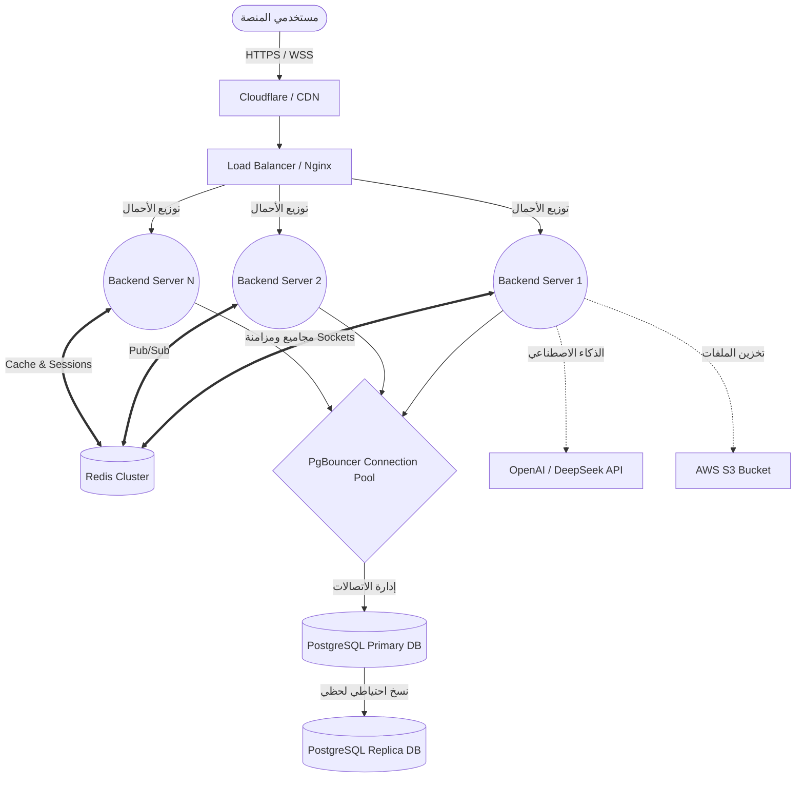
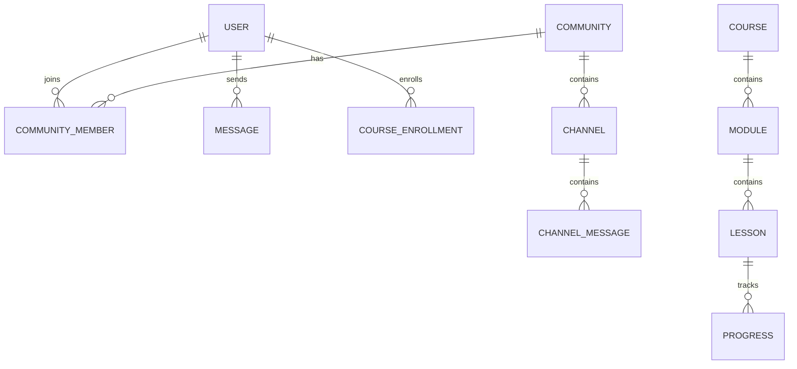

# SCS Platform — الثورة في التعليم الاجتماعي 🚀

> منصة تعليمية اجتماعية تجمع الكورسات، المجتمعات، الدردشة الفورية، والذكاء الاصطناعي في بيئة تفاعلية ومرنة، مصممة لاستيعاب **مليون مستخدم في نفس الوقت** بفضل هيكلتها المتقدمة.

---

## 🌟 جدول المحتويات
1. [نظرة عامة](#-نظرة-عامة)
2. [آلية عمل المشروع Flow](#-آلية-عمل-المشروع-flow)
3. [خرائط المشروع (Architecture & Database)](#-خرائط-المشروع-architecture--database)
4. [تجربة المستخدم UI/UX](#-تجربة-المستخدم-uiux)
5. [الأمان والتوسع (Scalability & Security)](#-الأمان-والتوسع-scalability--security)
6. [المشاكل المحلولة والمستقبلية (Troubleshooting)](#-المشاكل-المحلولة-والمستقبلية-troubleshooting)
7. [التشغيل السريع](#-التشغيل-السريع)

---

## 👁️‍🗨️ نظرة عامة
تم بناء SCS لتكون المزيج المتكامل الذي يغني المستخدم عن التنقل بين المنصات المختلفة:
- **نظام الكورسات (Udemy-like):** شراء وتعلم الكورسات مع تتبع التقدم.
- **مجتمعات وتواصل (Discord-like):** قنوات نصية وصوتية للمجتمعات.
- **ذكاء اصطناعي (ChatGPT-like):** مساعد ذكي مدمج لفهم الأكواد وتلخيص النصوص.
- **تجربة مستخدم احترافية:** تتميز بانتقالات 3D ناعمة، تأثيرات Tracking، وشاشات تحميل صممت خصيصاً لهوية المشروع.

---

## ⚙️ آلية عمل المشروع (Flow)

يعمل المشروع وفق معمارية تعتمد على فصل الواجهة (Frontend) عن الخادم الدقيق (Backend) والاعتماد على الـ WebSockets للتواصل اللحظي.

1. **دخول المستخدم (Authentication):** عند تسجيل الدخول، يتم إصدار JWT Access Token & Refresh Token، وتخزينهما بأمان (Token Rotation).
2. **الاتصال اللحظي (WebSockets):** يفتح الـ Frontend قناة اتصال مع السيرفر عبر `Socket.io`. بفضل الـ **Redis Adapter**، يستطيع مئات الآلاف من المستخدمين المتصلين بسيرفرات مختلفة تلقي نفس الرسائل والإشعارات في أجزاء من الثانية.
3. **تصفح الكورسات و الـ 3D UI:** الواجهة مبنية بـ `Next.js 14` و `Framer Motion` لتقديم تأثيرات (Transitions) مذهلة وشاشات تحميل (Custom 3D Loading) دون التأثير على سرعة الأداء.
4. **الاستعلام عن البيانات (Database):** للعمليات الثقيلة والمعقدة يتم استدعاء قاعدة البيانات `PostgreSQL` عبر `Prisma ORM`.

---

## 🗺️ خرائط المشروع (Architecture & Database)

### 1️⃣ هيكلية النظام (System Architecture)
هذه الخريطة توضح كيف يتوزع الحمل (Load Balancing) بين السيرفرات لاستيعاب مليون مستخدم.



### 2️⃣ مبنى قاعدة البيانات (Database Schema Overview)
بناء مصغر لأهم الجداول وعلاقاتها في المنصة:



---

## 🎨 تجربة المستخدم (UI/UX)
تم رفع مستوى احترافية الواجهة من خلال:
- **Page Transitions:** انتقال وتلاشي سلس (Blur & Slide) أثناء التنقل بين الصفحات.
- **3D Loading Spinner:** استبدال شاشات التحميل التقليدية بمجسم ثلاثي الأبعاد يدور ويسطع (Glow Effects) ليطابق هوية المشروع (SCS).
- **Smooth Animations:** تم استخدام وتضمين `Framer Motion` في الأزرار والبطاقات (Tilt and Hover Tracking) مما يعطي شعوراً بالحياة للتطبيق.

---

## 🔒 الأمان والتوسع (Scalability & Security)

### التوسع لمليون مستخدم
1. **الـ Stateless Server:** السيرفر لا يحفظ حالة الـ Sockets بداخله، بل تم دمج `@socket.io/redis-adapter` مما يسمح بتشغيل السيرفر على مئات الخوادم (Containers) دون خسارة الاتصال بين المستخدمين.
2. **Connection Pooling:** يجب تشغيل `PgBouncer` أمام السيرفرات لضمان عدم وصول اتصالات `Prisma` الحد الأقصى مع كثرة الطلبات.

### الأمان 
- **Rate Limiting & Helmet & HPP:** طبقات حماية للتصدي لهجمات الـ DDoS والـ XSS وغيرها.
- **JWT & Token Blacklisting:** أمان متقدم مع إمكانية إنهاء الجلسات المفتوحة للمستخدم من أي جهاز فوراً عبر Redis.

---

## 🛠️ المشاكل المحلولة والمستقبلية (Troubleshooting)

### ✅ مشاكل تم حلها 
1. **مشكلة فصل الاتصال (Socket Disconnects) عند زيادة الحمل:**
   - *الحل:* تم دمج `Redis Adapter` لتوزيع الغرف (Rooms) والرسائل عبر عدة خوادم مما ألغى نقطة الفشل الأحادية (Single Point of Failure).
2. **الواجهة جامدة والتنقل البطيء (Boring UI):**
   - *الحل:* تم بناء قالب `template.tsx` و `loading.tsx` مخصصين يدمجون `Framer Motion` لإضافة تأثيرات بصرية جذابة، متطورة، وتحافظ على الخفة.

### ⚠️ مشاكل قد تواجهك مستقبلاً وكيفية حلها
1. **مشكلة التكدس في قاعدة البيانات (Max Connections Reached):**
   - *السيناريو:* مع وصول عدد المتصلين لمليون شخص، قد تمتنع قاعدة بيانات Postgres عن استقبال اتصالات جديدة (`Too many clients`).
   - *كيفية التعامل معها:* تم تجهيز المشروع للعمل مع `PgBouncer`. تأكد من تفعيله في إعدادات الخادم الفعلي وإضافة `?pgbouncer=true` لرابط الـ `DATABASE_URL` في إعدادات Prisma.
   
2. **استهلاك الذاكرة العالي في Node.js (OOM - Out of Memory):**
   - *السيناريو:* مع تحميل ملفات ضخمة أو معالجة صور كثيرة في الـ Backend.
   - *كيفية التعامل معها:* قم بزيادة الخوادم (Horizontal Scaling) بدلاً من ترقية الخادم الرأسي، وتأكد من أن أحجام الرفع (Upload Limits) عبر `Nginx` محددة بصرامة (10MB مجهزة حالياً).
   
3. **تكلفة التخزين السحابي (S3 Storage Costs):**
   - *السيناريو:* المستخدمون يرفعون آلاف الملفات اليومية والمشاريع ومقاطع الفيديو، مما يستهلك المساحة سريعا.
   - *كيفية التعامل معها:* تفعيل `AWS S3 Lifecycle Rules` لمسح الملفات القديمة التي لا تخص الكورسات الأساسية بشكل تلقائي، أو استخدام `Cloudflare R2` لغياب رسوم الـ Egress.

---

## 🚀 التشغيل السريع
لبدء المشروع محلياً باستخدام `Docker`:

```bash
# 1. إعداد المتغيرات البيئية
cp .env.example .env

# 2. بناء وتشغيل المشروع متضمناً (Frontend, Backend, Redis, Postgres)
docker compose -f docker-compose.dev.yml up -d

# 3. إعداد وتنفيذ جداول قاعدة البيانات (تلقائياً)
docker compose -f docker-compose.dev.yml exec backend npx prisma migrate dev --name init

# 4. تغذية القاعدة ببيانات تجريبية (Admin & Courses)
docker compose -f docker-compose.dev.yml exec backend npm run prisma:seed
```

> **بمجرد التشغيل، ستستمتع بتجربة الـ UI/UX المحدثة مع السرعة الفائقة 🪄**
